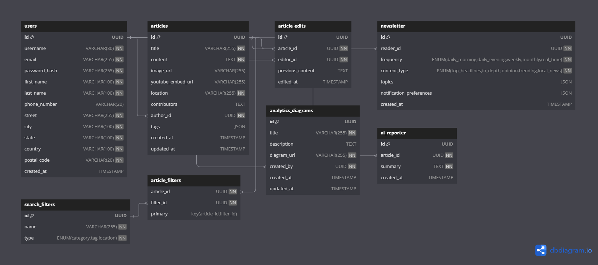

# Database Schema

# Layout



# Database Schema

## users
| Column Name      | Data Type        | Constraints                                                |
|------------------|------------------|------------------------------------------------------------|
| id               | UUID             | PRIMARY KEY                                                |
| username         | VARCHAR(30)      | NOT NULL, UNIQUE                                           |
| email            | VARCHAR(255)     | NOT NULL, UNIQUE, CHECK (email LIKE '%@zark.com')          |
| password_hash    | VARCHAR(255)     | NOT NULL, CHECK (LENGTH(password_hash) >= 12 AND password_hash ~ '[A-Z]' AND password_hash ~ '[a-z]' AND password_hash ~ '\d' AND password_hash ~ '[^\w\d\s]') |
| first_name       | VARCHAR(100)     | NOT NULL                                                   |
| last_name        | VARCHAR(100)     | NOT NULL                                                   |
| phone_number     | VARCHAR(20)      | UNIQUE, CHECK (phone_number ~ '^\+\d{1,15}$')              |
| street           | VARCHAR(255)     | NOT NULL                                                   |
| city             | VARCHAR(100)     | NOT NULL                                                   |
| state            | VARCHAR(100)     | NOT NULL                                                   |
| country          | VARCHAR(100)     | NOT NULL                                                   |
| postal_code      | VARCHAR(20)      | NOT NULL                                                   |
| created_at       | TIMESTAMP        | DEFAULT CURRENT_TIMESTAMP                                  |


## articles
| Column Name      | Data Type        | Constraints                                                |
|------------------|------------------|------------------------------------------------------------|
| id               | UUID             | PRIMARY KEY                                                |
| title            | VARCHAR(255)     | NOT NULL                                                   |
| content          | TEXT             | NOT NULL                                                   |
| image_url        | VARCHAR(255)     |                                                            |
| youtube_embed_url| VARCHAR(255)     |                                                            |
| tags             | JSON             |                                                            |
| location         | VARCHAR(255)     |                                                            |
| contributors     | TEXT             |                                                            |
| author_id        | UUID             | NOT NULL, FOREIGN KEY (author_id) REFERENCES users(id)     |
| created_at       | TIMESTAMP        | DEFAULT CURRENT_TIMESTAMP                                  |
| updated_at       | TIMESTAMP        | DEFAULT CURRENT_TIMESTAMP                                  |


## article_edits
| Column Name      | Data Type        | Constraints                                                |
|------------------|------------------|------------------------------------------------------------|
| id               | UUID             | PRIMARY KEY                                                |
| article_id       | UUID             | NOT NULL, FOREIGN KEY (article_id) REFERENCES articles(id) |
| editor_id        | UUID             | NOT NULL, FOREIGN KEY (editor_id) REFERENCES users(id)     |
| previous_content | TEXT             |                                                            |
| edited_at        | TIMESTAMP        | DEFAULT CURRENT_TIMESTAMP                                  |


## newsletters
| Column Name               | Data Type             | Constraints                                                  |
|---------------------------|-----------------------|--------------------------------------------------------------|
| id                        | UUID                  | PRIMARY KEY                                                  |
| reader_id                 | UUID                  | NOT NULL                                                     |
| frequency                 | ENUM('daily_morning', 'daily_evening', 'weekly', 'monthly', 'real_time') | NOT NULL  |
| content_type              | ENUM('top_headlines', 'in_depth', 'opinion', 'trending', 'local_news') | NOT NULL    |
| topics                    | JSON                  |                                                              |
| notification_preferences  | JSON                  |                                                              |
| created_at                | TIMESTAMP             | DEFAULT CURRENT_TIMESTAMP                                    |


## search_filters
| Column Name      | Data Type        | Constraints                                                |
|------------------|------------------|------------------------------------------------------------|
| id               | UUID             | PRIMARY KEY                                                |
| name             | VARCHAR(255)     | NOT NULL, UNIQUE                                           |
| type             | ENUM('category', 'tag', 'location') | NOT NULL                                |


## article_filters
| Column Name      | Data Type        | Constraints                                                       |
|------------------|------------------|-------------------------------------------------------------------|
| article_id       | UUID             | NOT NULL, FOREIGN KEY (article_id) REFERENCES articles(id)        |
| filter_id        | UUID             | NOT NULL, FOREIGN KEY (filter_id) REFERENCES search_filters(id)   |
| primary key      | (article_id, filter_id) |                                                            |


## research_diagrams
| Column Name      | Data Type        | Constraints                                                 |
|------------------|------------------|-------------------------------------------------------------|
| id               | UUID             | PRIMARY KEY                                                 |
| username         | VARCHAR(30)      | NOT NULL, unique                                            |
| description      | TEXT             |                                                             |
| diagram_url      | VARCHAR(255)     | NOT NULL                                                    |
| author_id       | UUID             | NOT NULL, FOREIGN KEY (author_id) REFERENCES users(id)       |
| created_at       | TIMESTAMP        | DEFAULT CURRENT_TIMESTAMP                                   |
| updated_at       | TIMESTAMP        | DEFAULT CURRENT_TIMESTAMP                                   |


## ai_reporters
| Column Name      | Data Type        | Constraints                                                |
|------------------|------------------|------------------------------------------------------------|
| id               | UUID             | PRIMARY KEY                                                |
| article_id       | UUID             | NOT NULL, FOREIGN KEY (article_id) REFERENCES articles(id) |
| summary          | TEXT             | NOT NULL                                                   |
| created_at       | TIMESTAMP        | DEFAULT CURRENT_TIMESTAMP                                  |


---


# DB & Relationships

   ```json

Table users {
    id INT [primary key, increment]
    first_name VARCHAR(100) [not null]
    last_name VARCHAR(100) [not null]
    email VARCHAR(255) [not null, unique]
    password_hash VARCHAR(255) [not null]
    role ENUM('editor', 'admin', 'reader') [not null]
    created_at TIMESTAMP [default: `CURRENT_TIMESTAMP`]
}

Table articles {
    id INT [primary key, increment]
    title VARCHAR(255) [not null]
    display_type VARCHAR(50) [not null]
    content TEXT [not null]
    image_filename VARCHAR(255)
    youtube_embed_url VARCHAR(255)
    location VARCHAR(255) [not null]
    contributors TEXT
    author_id INT [not null]
    section VARCHAR(50) [not null]
    tags TEXT [not null, default: '[]']
    created_at TIMESTAMP [default: `CURRENT_TIMESTAMP`]
    updated_at TIMESTAMP [default: `CURRENT_TIMESTAMP`]
    version_history TEXT [default: '[]']
}

Table subscriptions {
    id INT [primary key, increment]
    first_name VARCHAR(100) [not null]
    last_name VARCHAR(100) [not null]
    email VARCHAR(255) [not null, unique]
    frequency ENUM('Daily', 'Weekly', 'Monthly') [not null]
    sections TEXT [default: '[]']
    tags TEXT [default: '[]']
    subscribed_at TIMESTAMP [default: `CURRENT_TIMESTAMP`]
}

Table search_filters {
    id INT [primary key, increment]
    name VARCHAR(255) [not null, unique]
    type ENUM('category', 'tag', 'location') [not null]
}

Table article_filters {
    article_id INT [not null]
    filter_id INT [not null]
    primary key (article_id, filter_id)
}

Table research_diagrams {
    id INT [primary key, increment]
    title VARCHAR(255) [not null]
    description TEXT
    diagram_url VARCHAR(255) [not null]
    created_by INT [not null]
    created_at TIMESTAMP [default: `CURRENT_TIMESTAMP`]
    updated_at TIMESTAMP [default: `CURRENT_TIMESTAMP`]
}

Table ai_reporters {
    id INT [primary key, increment]
    article_id INT [not null]
    summary TEXT [not null]
    created_at TIMESTAMP [default: `CURRENT_TIMESTAMP`]
}

Ref: articles.author_id > users.id
Ref: article_filters.article_id > articles.id
Ref: article_filters.filter_id > search_filters.id
Ref: research_diagrams.created_by > users.id
Ref: ai_reporters.article_id > articles.id
```