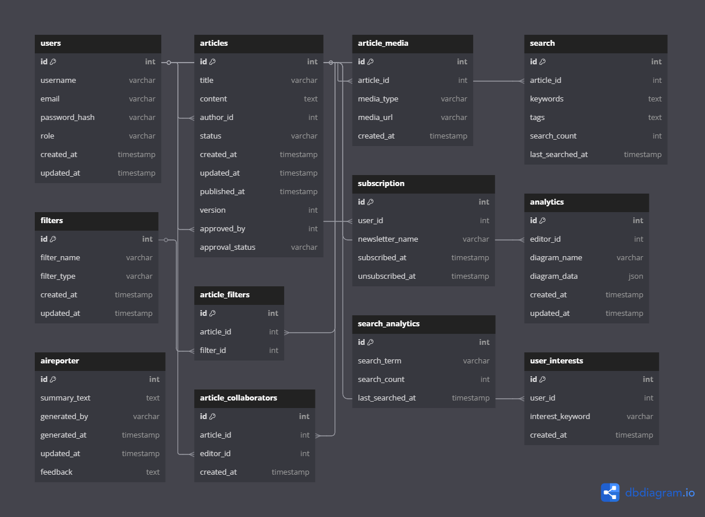

# Database Schema

# Layout

# Database Schema

## users
| Column Name      | Data Type        | Constraints                                                |
|------------------|------------------|------------------------------------------------------------|
| id               | UUID             | PRIMARY KEY                                                |
| username         | VARCHAR(30)      | NOT NULL, UNIQUE, CHECK (username ~ '^[A-Za-z0-9_]{3,30}$') |
| email            | VARCHAR(255)     | NOT NULL, UNIQUE, CHECK (email ~* '^[A-Za-z0-9._%+-]+@[A-Za-z0-9.-]+\.[A-Za-z]{2,}$' AND email = LOWER(email)) |
| password_hash    | VARCHAR(255)     | NOT NULL                                                   |
| phone_number     | VARCHAR(20)      | UNIQUE, CHECK (phone_number ~ '^\+\d{1,15}$')              |
| address          | TEXT             |                                                            |
| created_at       | TIMESTAMP        | DEFAULT CURRENT_TIMESTAMP                                   |

## articles
| Column Name      | Data Type        | Constraints                                                |
|------------------|------------------|------------------------------------------------------------|
| id               | UUID             | PRIMARY KEY                                                |
| title            | VARCHAR(255)     | NOT NULL                                                   |
| content          | TEXT             | NOT NULL                                                   |
| image_url        | VARCHAR(255)     |                                                            |
| youtube_embed_url| VARCHAR(255)     |                                                            |
| tags             | JSON             |                                                            |
| location         | VARCHAR(255)     |                                                            |
| contributors     | TEXT             |                                                            |
| author_id        | UUID             | NOT NULL, FOREIGN KEY (author_id) REFERENCES users(id)     |
| created_at       | TIMESTAMP        | DEFAULT CURRENT_TIMESTAMP                                   |
| updated_at       | TIMESTAMP        | DEFAULT CURRENT_TIMESTAMP                                   |

## article_edits
| Column Name      | Data Type        | Constraints                                                |
|------------------|------------------|------------------------------------------------------------|
| id               | UUID             | PRIMARY KEY                                                |
| article_id       | UUID             | NOT NULL, FOREIGN KEY (article_id) REFERENCES articles(id) |
| editor_id        | UUID             | NOT NULL, FOREIGN KEY (editor_id) REFERENCES users(id)     |
| previous_content | TEXT             |                                                            |
| edited_at        | TIMESTAMP        | DEFAULT CURRENT_TIMESTAMP                                   |

## newsletter
| Column Name               | Data Type             | Constraints                                                  |
|---------------------------|-----------------------|--------------------------------------------------------------|
| id                        | UUID                  | PRIMARY KEY                                                  |
| reader_id                 | UUID                  | NOT NULL, FOREIGN KEY (reader_id) REFERENCES users(id)       |
| frequency                 | ENUM('daily_morning', 'daily_evening', 'weekly', 'monthly', 'real_time') | NOT NULL                                                   |
| content_type              | ENUM('top_headlines', 'in_depth', 'opinion', 'trending', 'local_news') | NOT NULL                                                   |
| topics                    | JSON                  |                                                              |
| notification_preferences  | JSON                  |                                                              |
| created_at                | TIMESTAMP             | DEFAULT CURRENT_TIMESTAMP                                     |

## search_filters
| Column Name      | Data Type        | Constraints                                                |
|------------------|------------------|------------------------------------------------------------|
| id               | UUID             | PRIMARY KEY                                                |
| name             | VARCHAR(255)     | NOT NULL, UNIQUE                                           |
| type             | ENUM('category', 'tag', 'location') | NOT NULL                                               |

## article_filters
| Column Name      | Data Type        | Constraints                                                |
|------------------|------------------|------------------------------------------------------------|
| article_id       | UUID             | NOT NULL, FOREIGN KEY (article_id) REFERENCES articles(id) |
| filter_id        | UUID             | NOT NULL, FOREIGN KEY (filter_id) REFERENCES search_filters(id) |
| primary key      | (article_id, filter_id) |                                                            |

## analytics_diagrams
| Column Name      | Data Type        | Constraints                                                |
|------------------|------------------|------------------------------------------------------------|
| id               | UUID             | PRIMARY KEY                                                |
| title            | VARCHAR(255)     | NOT NULL                                                   |
| description      | TEXT             |                                                            |
| diagram_url      | VARCHAR(255)     | NOT NULL                                                   |
| created_by       | UUID             | NOT NULL, FOREIGN KEY (created_by) REFERENCES users(id)    |
| created_at       | TIMESTAMP        | DEFAULT CURRENT_TIMESTAMP                                   |
| updated_at       | TIMESTAMP        | DEFAULT CURRENT_TIMESTAMP                                   |

## ai_reporter
| Column Name      | Data Type        | Constraints                                                |
|------------------|------------------|------------------------------------------------------------|
| id               | UUID             | PRIMARY KEY                                                |
| article_id       | UUID             | NOT NULL, FOREIGN KEY (article_id) REFERENCES articles(id) |
| summary          | TEXT             | NOT NULL                                                   |
| created_at       | TIMESTAMP        | DEFAULT CURRENT_TIMESTAMP                                   |

---

# Relationships

- `articles.author_id > users.id` // many-to-one
- `article_edits.article_id > articles.id` // many-to-one
- `article_edits.editor_id > users.id` // many-to-one
- `newsletter.reader_id > users.id` // many-to-one
- `article_filters.article_id > articles.id` // many-to-one
- `article_filters.filter_id > search_filters.id` // many-to-one
- `analytics_diagrams.created_by > users.id` // many-to-one
- `ai_reporter.article_id > articles.id` // many-to-one